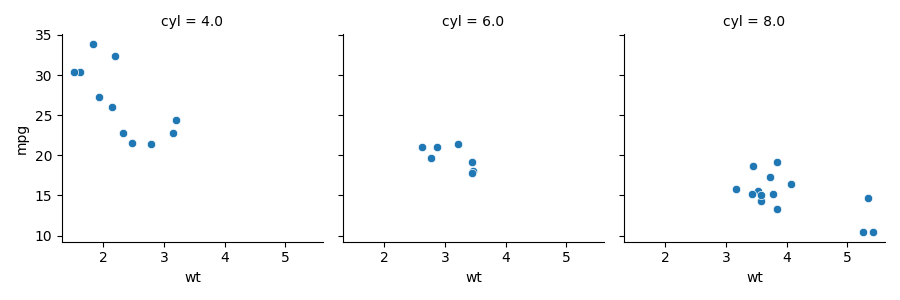

# Week 4 lab



Questions:

1. snakemake --delete-all-output

2. I think the best implementation I've found is to use the `temp()` flag around the output you want to delete in the Snakefile.

3. Köster, Johannes and Rahmann, Sven. “Snakemake - A scalable bioinformatics workflow engine”. Bioinformatics 2012.

Evidence of Correct behavior:

Begin

```
(snakemake) julio@Lab:/media/julio/Storage/ecoevo283/Week4$ ls -lh
total 2.0K
-rwxrwxrwx 1 julio julio 364 Jan 28 16:08 plot_gen.py
-rwxrwxrwx 1 julio julio  49 Jan 29 16:13 README.md
-rwxrwxrwx 1 julio julio 223 Jan 29 10:49 Snakefile
-rwxrwxrwx 1 julio julio 216 Jan 29 11:51 sqlite3_maker.R
```

Create output:

```
(snakemake) julio@Lab:/media/julio/Storage/ecoevo283/Week4$ snakemake -j1
Building DAG of jobs...
Using shell: /bin/bash
Provided cores: 1 (use --cores to define parallelism)
Rules claiming more threads will be scaled down.
Job counts:
	count	jobs
	1	all
	1	make_plot
	1	make_sqlite3
	3
Select jobs to execute...

[Mon Feb  1 19:04:05 2021]
rule make_sqlite3:
    output: mtcars.sqlite3
    jobid: 1

[Mon Feb  1 19:04:06 2021]
Finished job 1.
1 of 3 steps (33%) done
Select jobs to execute...

[Mon Feb  1 19:04:06 2021]
rule make_plot:
    input: mtcars.sqlite3
    output: mtcars.png
    jobid: 2

[Mon Feb  1 19:04:07 2021]
Finished job 2.
2 of 3 steps (67%) done
Select jobs to execute...

[Mon Feb  1 19:04:07 2021]
localrule all:
    input: mtcars.sqlite3, mtcars.png
    jobid: 0

[Mon Feb  1 19:04:07 2021]
Finished job 0.
3 of 3 steps (100%) done
Complete log: /media/julio/Storage/ecoevo283/Week4/.snakemake/log/2021-02-01T190405.827101.snakemake.log
```

Touch R script:

```
(snakemake) julio@Lab:/media/julio/Storage/ecoevo283/Week4$ touch sqlite3_maker.R 
(snakemake) julio@Lab:/media/julio/Storage/ecoevo283/Week4$ snakemake -j1 -R `snakemake --list-code-changes`
Building DAG of jobs...
Building DAG of jobs...
Using shell: /bin/bash
Provided cores: 1 (use --cores to define parallelism)
Rules claiming more threads will be scaled down.
Job counts:
	count	jobs
	1	all
	1	make_plot
	1	make_sqlite3
	3
Select jobs to execute...

[Mon Feb  1 19:08:08 2021]
rule make_sqlite3:
    output: mtcars.sqlite3
    jobid: 1

[Mon Feb  1 19:08:09 2021]
Finished job 1.
1 of 3 steps (33%) done
Select jobs to execute...

[Mon Feb  1 19:08:09 2021]
rule make_plot:
    input: mtcars.sqlite3
    output: mtcars.png
    jobid: 2

[Mon Feb  1 19:08:10 2021]
Finished job 2.
2 of 3 steps (67%) done
Select jobs to execute...

[Mon Feb  1 19:08:10 2021]
localrule all:
    input: mtcars.sqlite3, mtcars.png
    jobid: 0

[Mon Feb  1 19:08:10 2021]
Finished job 0.
3 of 3 steps (100%) done
Complete log: /media/julio/Storage/ecoevo283/Week4/.snakemake/log/2021-02-01T190808.937293.snakemake.log
```

Touch sqlite3 db:

```
(snakemake) julio@Lab:/media/julio/Storage/ecoevo283/Week4$ snakemake -j1 -R `snakemake --list-code-changes`
Building DAG of jobs...
Building DAG of jobs...
Using shell: /bin/bash
Provided cores: 1 (use --cores to define parallelism)
Rules claiming more threads will be scaled down.
Job counts:
	count	jobs
	1	all
	1	make_plot
	2
Select jobs to execute...

[Mon Feb  1 19:10:18 2021]
rule make_plot:
    input: mtcars.sqlite3
    output: mtcars.png
    jobid: 2

[Mon Feb  1 19:10:19 2021]
Finished job 2.
1 of 2 steps (50%) done
Select jobs to execute...

[Mon Feb  1 19:10:19 2021]
localrule all:
    input: mtcars.sqlite3, mtcars.png
    jobid: 0

[Mon Feb  1 19:10:19 2021]
Finished job 0.
2 of 2 steps (100%) done
Complete log: /media/julio/Storage/ecoevo283/Week4/.snakemake/log/2021-02-01T191018.375859.snakemake.log
```
